# Fluid Pipes (Fabric and NeoForge)

The primary use of fluid pipes is to carry fluids around the world.
But they are not limited to this.  
Water dripping from pipes can be used for watering plants.
And, in the Minecraft world, which is not limited by material preservation laws,
new water and lava sources can be created from the dripping liquid by collecting it
into cauldrons, or by pushing it into empty cauldrons.
Lava can even be pushed into furnaces to power them.

There are 10 different types of wooden pipes and 10 different types of stone pipes.
These differ not only in their textures, but also in their capabilities.
Some are better for carrying water, some for carrying lava.
Some can be used for watering plants.

Wooden pipes are better for carrying water, although some can carry lava too.
Unfortunately, they tend to burst into flames when carrying lava and not underwater.

Stone pipes are better for carrying lava, although some can carry water too.

Most pipes are too slow, or clogging too often to be of any use.
Others are just average performers.
But there is always one type of pipe which is far better than all the others for every use case.
And it is not always the most expensive one.

### Pipes

Pipe recipes are simple.

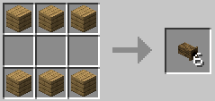

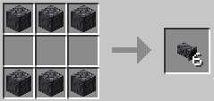

Pipes can be turned after placement with a hoe.

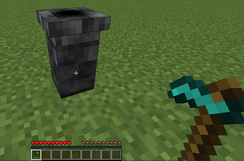 ==> 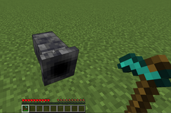

### Fittings

Fittings can be used to join pipes neatly, and to generate intersections.
Fittings are sensitive to redstone power too.
If they are powered, they stop transfering fluid.

Fittings are made of pipes:

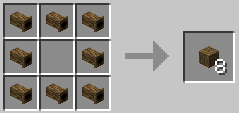

### Examples

* Two different type of pipe, side by side:

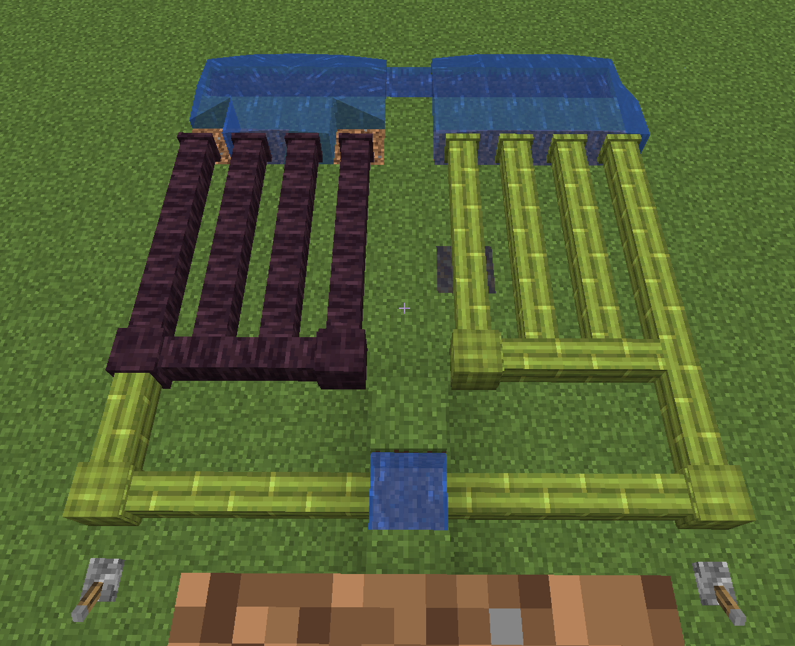

Notice the difference. The left one is clogging often, and supply water only intermittently.

* Water pipes used on a sugar cane planatation:

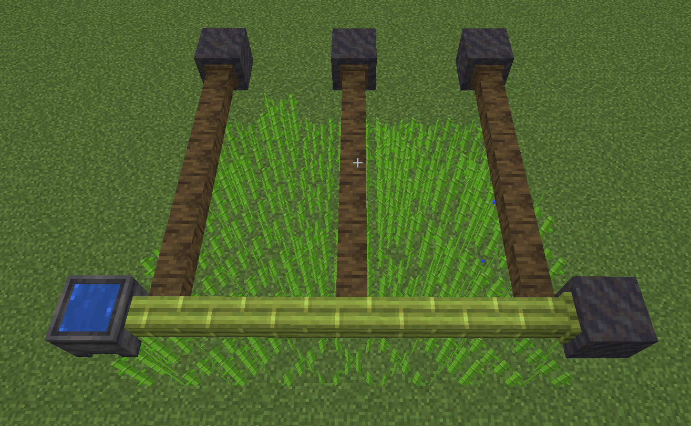

* A fountain with a switch:

ON:  
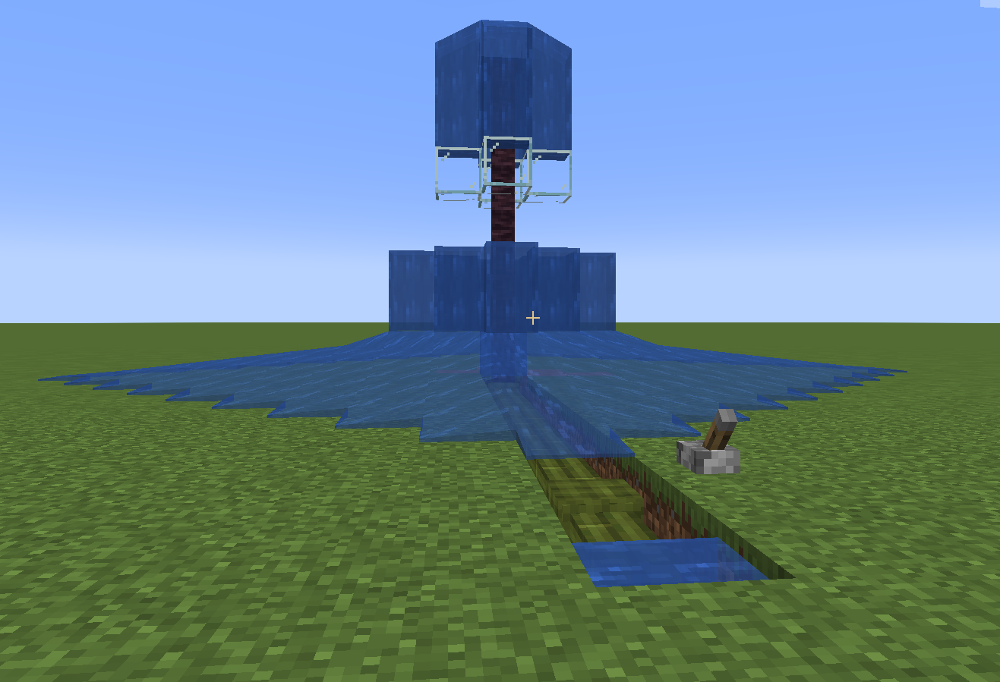

OFF:  
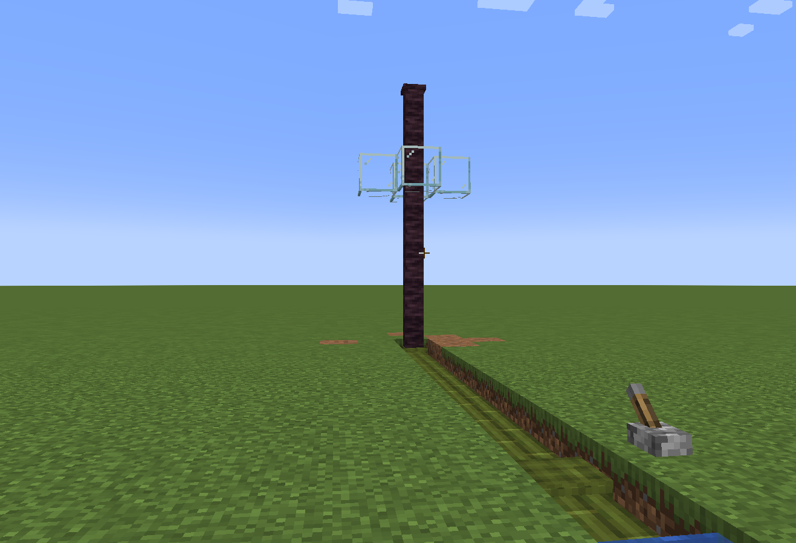

The occasional clogging of the pipe even enhances its appearance.

* Creating new lava sources:

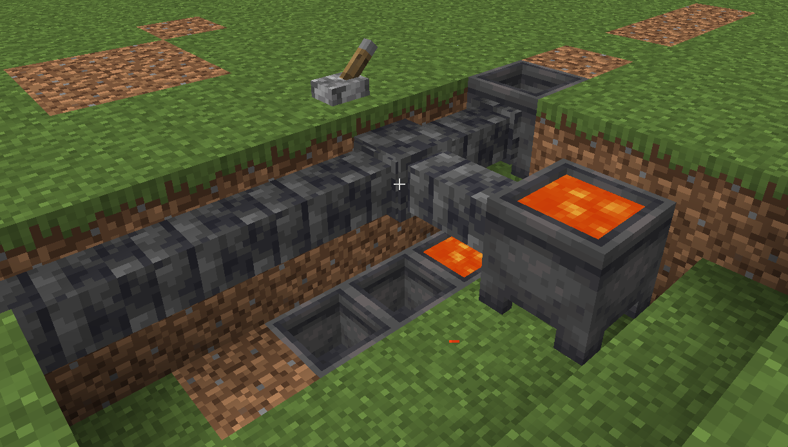

Collecting the drips is less efficient than pushing the fluid into a cauldron.  
(Not all pipes can push all liquids into a cauldron, and their speed is also different.)

* A glass manufacturing factory

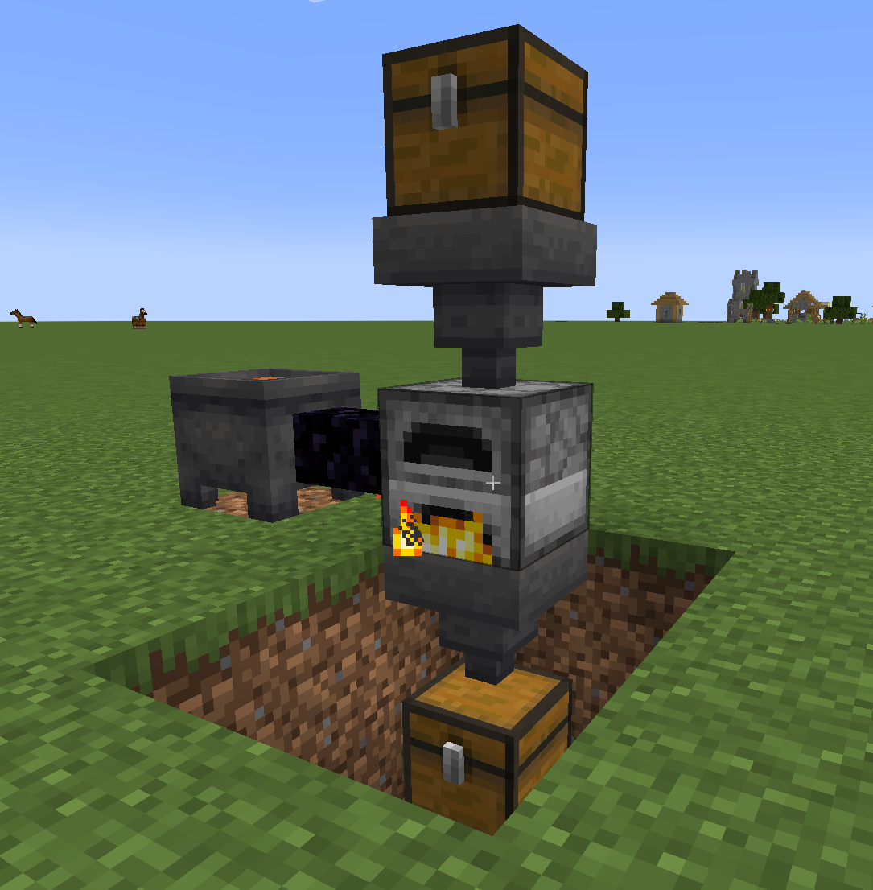

There is an empty bucket in the fuel slot of the furnace and the top chest is filled with sand.  
The short pipe, carrying lava, fills it up at the same rate it would fill up a cauldron.  
With the right type of pipe, this result in an almost continuous operation of the furnace,
without adding any more fuel into it.

## License

Standard MIT license. Feel free to learn from it and incorporate it in your own projects.

## Source code

Available on [GitLab](https://gitlab.com/pintergabor/fluidpipes.git)
or [GitHub](https://github.com/pinter-gabor-at/fluidpipes.git).

## For developers

Quite often, when I start learning programming on a new platform, I find even the simplest examples too complicated.
Tutorials, written by experts, with years of experience programming on that platform, sometimes forget how difficult
those first step are.  
This is why I decided to make all my Minecraft mods publicly available, and documented them meticulously.

## Requires (Fabric)

- [Fabric API](https://modrinth.com/mod/fabric-api).

## Thanks

This mod was inspired by [Simple Copper Pipes](https://modrinth.com/mod/simple-copper-pipes) made
by [Lunade](https://modrinth.com/user/Lunade).
