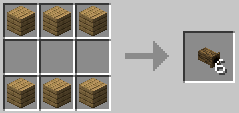
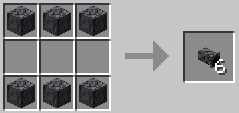
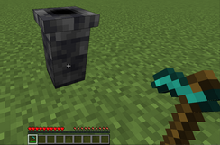
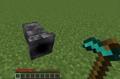
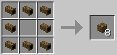
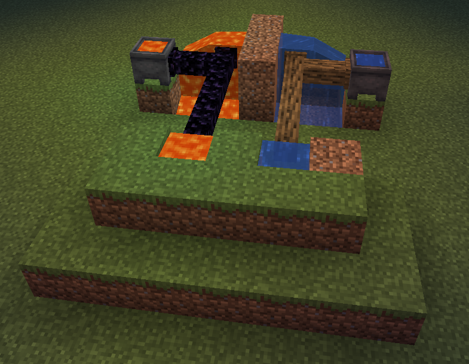
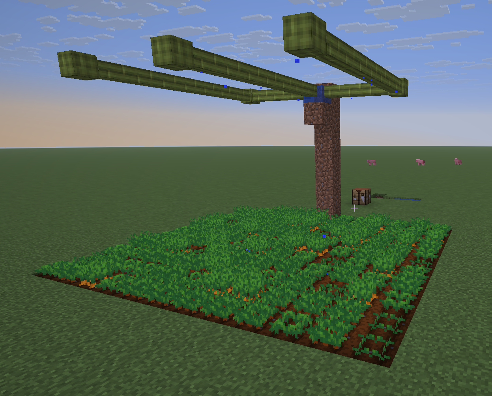
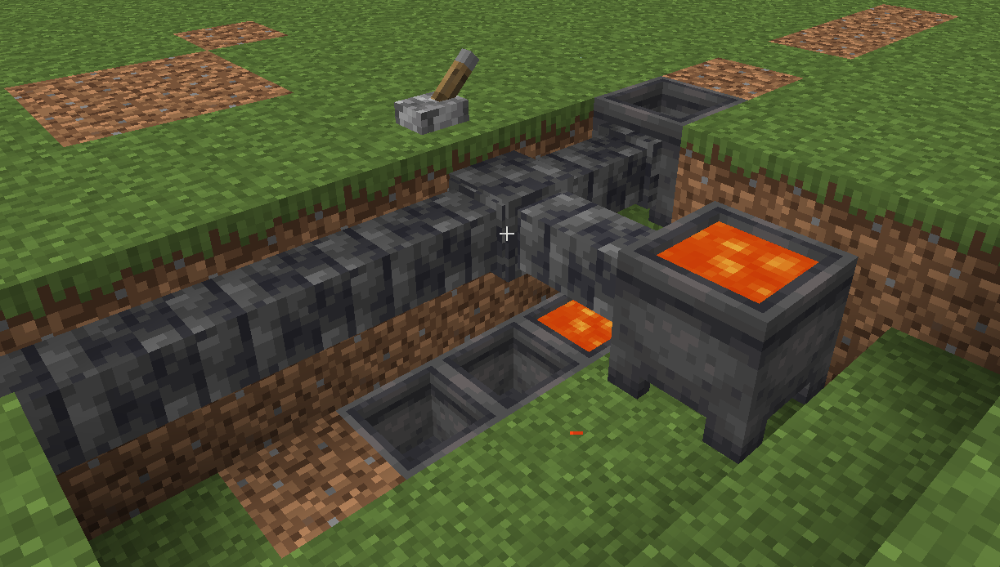
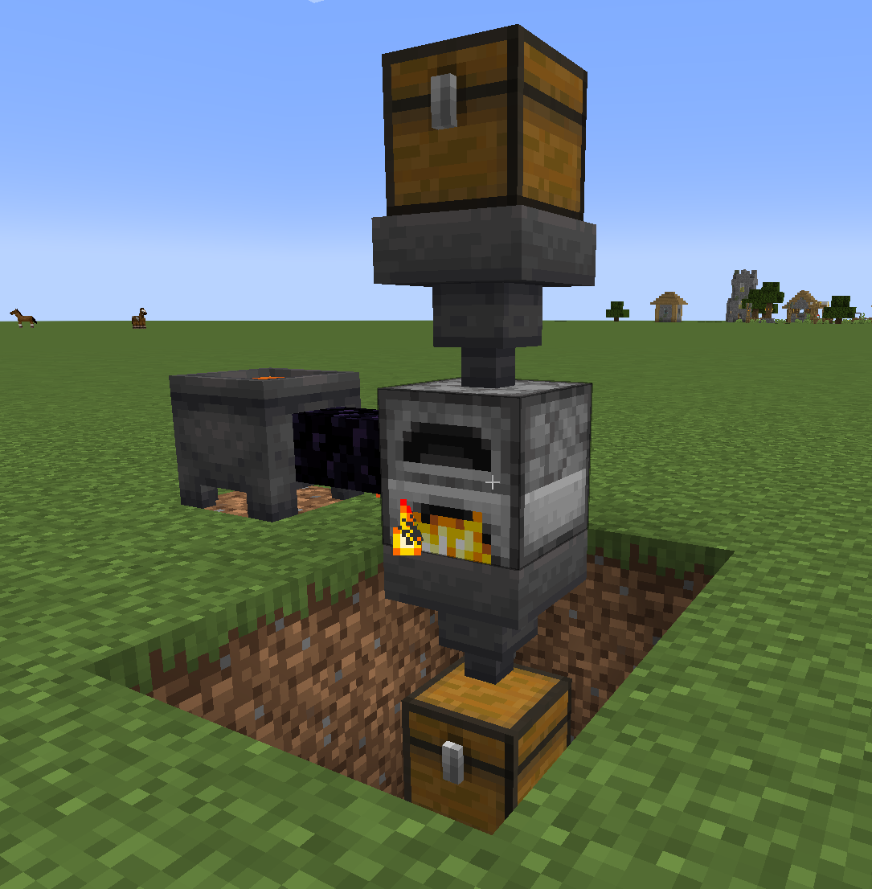

# Fluid Pipes Mini (Fabric and NeoForge)

The primary use of fluid pipes is to carry fluids around the world.
But they are not limited to this.  
Water dripping from pipes can be used for watering plants.
And, in the Minecraft world, which is not limited by material preservation laws,
new water and lava sources can be created from the dripping liquid by collecting it
into cauldrons, or by pushing it into empty cauldrons.
Lava can even be pushed into furnaces to power them.

Unlike my full-featured [Fluid Pipes](https://modrinth.com/mod/fluidpipes) mod,
where there are 10 different types of wooden pipes
and 10 different types of stone pipes, this mod only has 4.
But this mod is smaller and faster and easier to master.
Each pipe has a different purpose:

- Wood pipes are good for carrying water, they are fast, but not dripping, so they cannot be used for irrigation.
- Bamboo pipes are not so fast, but they can be used for any purpose.
- Obsidian pipes are good for carrying lava, but expensive and hard to break.
- Stone pipes can also be used for carrying lava, but the dripping lava may make them a little less comfortable.

### Pipes

Pipe recipes are simple.

Pipes can be turned after placement with a hoe.

 ==> 

### Fittings

Fittings can be used to join pipes neatly, and to generate intersections.
Fittings are sensitive to redstone power too.
If they are powered, they stop transfering fluid.

Fittings are made of pipes:

### Examples

* Two different types of pipe, side by side:

* Water pipes used on a carrot planatation:

* Creating new lava sources:

Collecting the drips is less efficient than pushing the fluid into a cauldron.

* A glass manufacturing factory

There is an empty bucket in the fuel slot of the furnace and the top chest is filled with sand.  
The short pipe, carrying lava, fills it up at the same rate it would fill up a cauldron.  
With the right type of pipe, this result in an almost continuous operation of the furnace,
without adding any more fuel into it.

## License

Standard MIT license. Feel free to learn from it and incorporate it in your own projects.
But if you want to support me, please [buy me a coffee](https://buymeacoffee.com/pintergabor).

## Source code

Available on [GitLab](https://gitlab.com/pintergabor/fluidpipesmini.git)
or [GitHub](https://github.com/pinter-gabor-at/fluidpipesmini.git).

## For developers

Quite often, when I start learning programming on a new platform, I find even the simplest examples too complicated.
Tutorials, written by experts, with years of experience programming on that platform, sometimes forget how difficult
those first step are.  
This is why I decided to make all my Minecraft mods publicly available, and documented them meticulously.

## Requires (Fabric)

- [Fabric API](https://modrinth.com/mod/fabric-api).

## Incompatible with

- [Fluid Pipes](https://modrinth.com/mod/fluidpipes), because that defines more, and differently configured, pipes.

## Thanks

This mod was inspired by [Simple Copper Pipes](https://modrinth.com/mod/simple-copper-pipes) made
by [Lunade](https://modrinth.com/user/Lunade).

## TODO

- Forge version: [only if you buy me a coffee](https://buymeacoffee.com/pintergabor).

## See also

My other mods on [Modrinth](https://modrinth.com/user/pinter.gabor)
and on [CurseForge](https://www.curseforge.com/members/pintergabor/projects).
